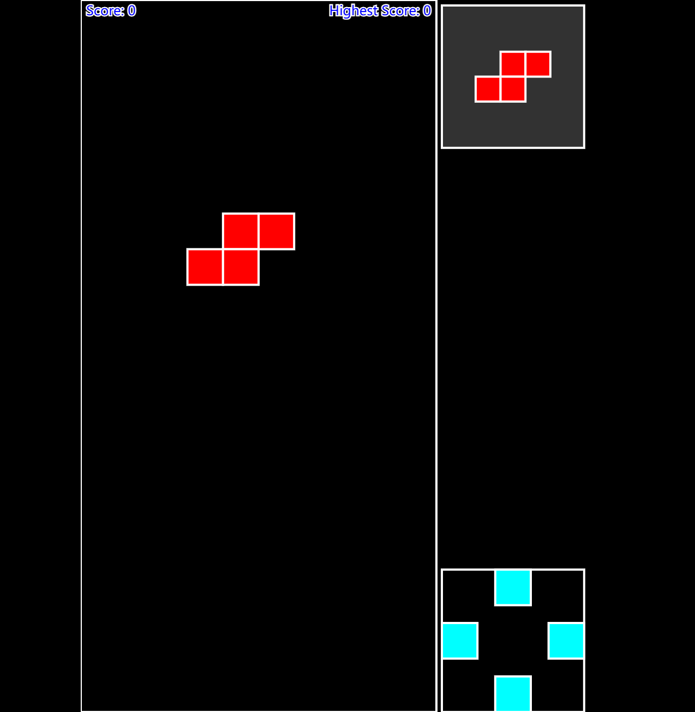

# Tetris of Color

这是一个基于 `p5.js` 实现的俄罗斯方块游戏，具有“下一个方块”提示功能和分数显示功能。

## 功能特性

- **经典俄罗斯方块玩法**：方块会自动下落，玩家可以通过键盘控制方块的移动和旋转。
- **下一个方块提示**：右侧提示框显示下一个即将出现的方块。
- **分数系统**：每消除一行会增加分数。
- **游戏结束提示**：当方块堆满屏幕时，显示“Game Over”提示。
- **重新开始功能**：按 `R` 键可以重新开始游戏。

---

## 项目结构

```

Tetris_of_Color/
├── public/
│ ├── index.html # 游戏的 HTML 文件
│ ├── style.css # 游戏的样式文件
│ ├── sketch.js # 游戏的核心逻辑（p5.js 实现）
│ ├── p5.js # p5.js 库
│ └── p5.sound.min.js # p5.js 声音库
└── README.md # 项目说明文件

```

---

## 如何运行

### 1. 本地运行

1. 确保你已经安装了 [Node.js](https://nodejs.org/)。
2. 在项目根目录下运行以下命令启动本地服务器：

   ```bash
   npx http-server public
   ```

3. 打开浏览器访问 `http://localhost:8080`。

### 2. 部署到 GitHub Pages

1. 将项目推送到 GitHub 仓库。
2. 在 GitHub 仓库的 **Settings** > **Pages** 中启用 GitHub Pages。
3. 部署完成后，你可以通过 `https://<your-username>.github.io/<your-repo-name>/` 访问游戏。

### 3. 部署到 Vercel

1. 将项目推送到 GitHub 仓库。
2. 用Vervel关联Github。
3. 然后直接在Vercel中导入该项目即可。

---

## 游戏操作

- **方向键**：
  - 左箭头：向左移动方块。
  - 右箭头：向右移动方块。
  - 下箭头：加速方块下落。
  - 上箭头：旋转方块。
- **R 键**：重新开始游戏。

---

## 截图

### 游戏界面



---

## 技术栈

- **p5.js**：用于实现游戏的图形和交互逻辑。
- **HTML5 & CSS3**：用于构建游戏界面。
- **JavaScript**：用于实现游戏逻辑。

---

## 未来改进

- 添加更多的游戏模式（如计时模式、无尽模式）。
- 添加背景音乐和音效。
- 支持移动端操作。
- 提供排行榜功能。

---

## 贡献

欢迎提交 Issue 或 Pull Request 来改进此项目！

---

## 许可证

本项目基于 [MIT License](LICENSE) 开源。

---

### 如何使用

1. 将上述内容保存为项目根目录下的 `README.md` 文件。
2. 提交到你的 GitHub 仓库，其他人可以通过该文件了解项目的功能和使用方法。

如果需要进一步修改或添加内容，请告诉我！
